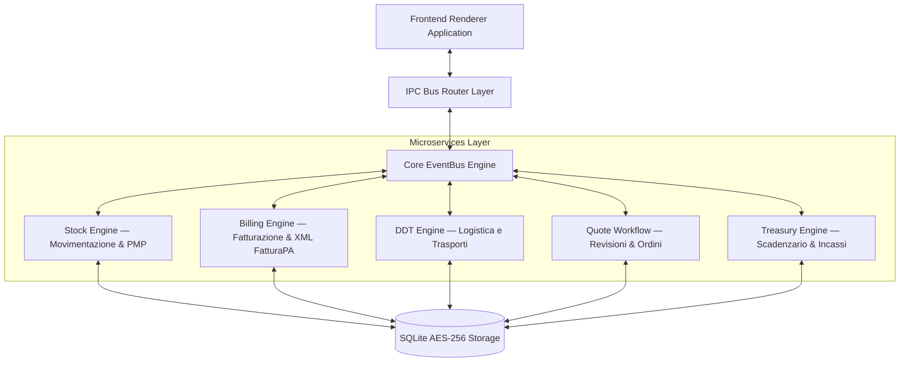

# Enterprise ERP System — Fatturazione, Magazzino & Preventivi

**Piattaforma gestionale desktop aziendale ad architettura a microservizi** — sviluppata da NunzioTech.

[](https://github.com/AprileNunzio/SimulatorePreventivi/releases/latest)
[](https://github.com/AprileNunzio/SimulatorePreventivi/releases)
[](#-architettura-a-microservizi)
[](LICENSE)

---

## 🚀 Download e Installazione

Il software viene distribuito con un **Installer Automatico per Windows** e sistema di aggiornamento in background.

1. Vai alla pagina ufficiale delle Release: **[👉 Download Ultima Versione](https://github.com/AprileNunzio/SimulatorePreventivi/releases/latest)**
2. Scarica il file installer `Simulatore.Preventivi.Setup.X.X.X.exe`.
3. Esegui il file. L'installatore si occuperà della configurazione iniziale in `C:\NunzioTech\` e creerà il collegamento sul Desktop.

---

## 🧩 Architettura a Microservizi e Micro-Moduli

La piattaforma adotta un'architettura **Event-Driven Microservices** completamente disaccoppiata sul backend Node.js / Electron:



---

## ✨ Moduli Gestionali

| Modulo | Funzionalità Enterprise |
|---|---|
| **Preventivazione Avanzata** | Workflow stati (*Preventivo -> Revisione -> Ordine di Vendita*), sconti, spese accessorie e calcolo margine lordo/netto in tempo reale. |
| **Magazzino & PMP** | Registro movimenti atomici (`carico`, `scarico`, `reso`, `rettifica`), valorizzazione a **Prezzo Medio Ponderato (PMP)** e avvisi scorta minima. |
| **Logistica & DDT** | Generazione Documenti di Trasporto (DDT), gestione merci in viaggio, resa porto/vettore e aggregazione per **Fatturazione Differita (`TD24`)**. |
| **Generazione FatturaPA** | Generazione del tracciato **FatturaPA v1.2.2** (`TD01`-`TD06`, `TD24`), **Multi-IVA per riga**, Natura IVA (`N1`..`N7`), Ritenuta d'Acconto e Cassa Previdenziale (`TC03`). La **trasmissione allo SdI** è in roadmap tramite adapter verso canale accreditato (vedi Documentazione tecnica). |
| **Tesoreria & Scadenzario** | Piani di rateizzazione incassi/pagamenti, monitoraggio scadenze aperte/scadute e registrazione Prima Nota finanziaria. |
| **Collaboratori & Provvigioni** | Assegnazione lavori su commessa, tracciamento commissioni fisse o percentuali e ledger pagamenti dedicati. |
| **Sicurezza & Backup** | Cifratura del database locale, backup automatici locali e sincronizzazione cloud opzionale (MySQL/FTP). |

---

## 📚 Documentazione tecnica

- **[Gap Analysis](docs/GAP_ANALYSIS.md)** — stato reale del prodotto e distanza da un gestionale universale production-ready.
- **[Implementation Plan](docs/IMPLEMENTATION_PLAN.md)** — architettura a micro-moduli, convenzioni di codice e roadmap a fasi.
- **[Changelog](.github/CHANGELOG.md)** · **[Contributing](.github/CONTRIBUTING.md)** · **[Security Policy](.github/SECURITY.md)**

> ⚠️ **Stato del prodotto:** funzionalità di generazione documenti e gestione operativa complete; gli adempimenti fiscali con trasmissione reale (SdI, corrispettivi telematici, registri IVA) sono in roadmap. Consultare la Gap Analysis prima di ogni uso in contesto fiscale.

---

## 🖥 Stack Tecnologico

- **Core**: Electron v29 + Node.js Microservices Layer
- **Storage Engine**: `sql.js` (SQLite in WebAssembly) con cifratura **AES-256**
- **Formatting & Export**: `fast-xml-parser` (XML FatturaPA) + `PDFKit` (PDF vettoriali A4) + `ExcelJS`
- **Networking & Async**: `ws` (WebSockets) + Node `EventEmitter` Bus
- **Distribution**: `electron-updater` + GitHub Releases

---

## 🔧 Sviluppo Locale

```bash
git clone https://github.com/AprileNunzio/SimulatorePreventivi.git
cd SimulatorePreventivi

npm install

npm run dev

npm run build
```

**Convenzioni di progetto:** codice senza commenti (solo codice puro), micro-moduli a singola responsabilità, confini di dominio netti. Dettagli in [IMPLEMENTATION_PLAN.md](docs/IMPLEMENTATION_PLAN.md).

---

## 📄 Licenza

Software proprietario — NunzioTech © 2026. Tutti i diritti riservati.
